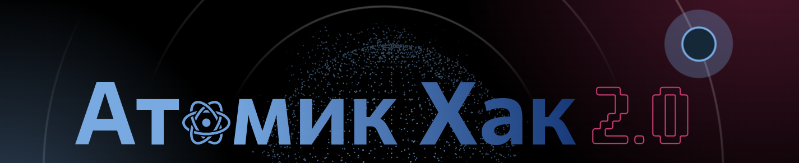
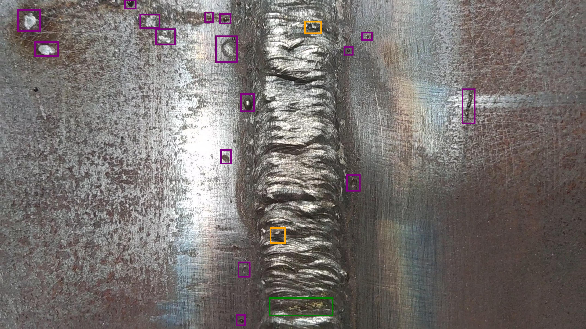

# Поиск дефектов сварных швов



## Ссылки

Сайт соревнования: [atomichack.ru](https://atomichack.ru/) \
GitHub: [github.com/werserk/AtomicHack](https://github.com/werserk/AtomicHack) \
Презентация: [LINK](https://docs.google.com/presentation/d/1rcH_EbmP8-rjSrcMAn7ZxIdogTCiCjg5LeDol3n1LJk/edit#slide=id.g2e5e08b022d_3_69) \
Решение: [welding.medpaint.ru](https://welding.medpaint.ru) \
Веса лучшей на нашей валидации модели: [LINK](https://drive.google.com/drive/folders/1SxKk1MI6GMpJQz-rJXD6erh0uTLwykaD?usp=sharing) \
Полный код: [LINK]()

## Описание

Визуальный осмотр сварных швов на предмет дефектов - долгая и трудоёмкая задача.
Зачастую молодые специалисты не могут определить все свои дефекты из-за чего всё больше повторяются свои ошибки.

Для решения этой проблемы мы разработали веб-платформу на основе искуственного интеллекта,
помогающую быстро и качественно найти дефекты на изображении сварного шва.

### Пример шва с дефектами



### Функциональность решения

Наше решение предлагает такой функционал:

* Обрабатываем как фото, так и видео
* Анализируем в режиме реального времени с камеры устройства
* Предоставляем API для подключения устройств, других интерфейсов (alpha)
* Автоматически измеряем размеры дефектов (pre-alpha)
* Формируем отчёт о найденных на швах дефектах и их размерах

## Установка

### Основной запуск

Склонируйте репозиторий:

```bash
git clone https://github.com/werserk/AtomicHack.git && cd AtomicHack
```

Запустите Docker:

```bash
docker compose up
```

### Самостоятельный запуск

Можно попробовать запустить без докера, однако с установкой super-gradients могут возникнуть проблемы.
Пробовать на свой страх и риск.

Установите зависимости:

```bash
poetry install
```

Запуск стримлита:

```bash
streamlit run streamlit_app.py
```

Запуск бэкенда (если нужен API)

```bash
uvicorn app.server:app --host 0.0.0.0 --port 8000
```

## Предсказание одного из submission.csv

```bash
python3 submit.py
```
Возможно потребуется сделать это изнутри докера.

## Структура проекта

```
app/
├── __init__.py
├── neuro
│   ├── __init__.py
│   ├── roboflow_net
│   │   ├── config.py
│   │   ├── core.py
│   │   └── __init__.py
│   ├── utils.py
│   └── yolo_nas_net
│       ├── config.py
│       ├── core.py
│       └── __init__.py
├── server
│   ├── core.py
│   ├── __init__.py
│   └── utils.py
└── web
    ├── core.py
    ├── __init__.py
    ├── pages
    │   ├── capture_video.py
    │   ├── __init__.py
    │   ├── upload_image.py
    │   ├── upload_video.py
    │   └── welcome.py
    └── utils
        ├── __init__.py
        ├── predict.py
        ├── tables.py
        └── video.py
```